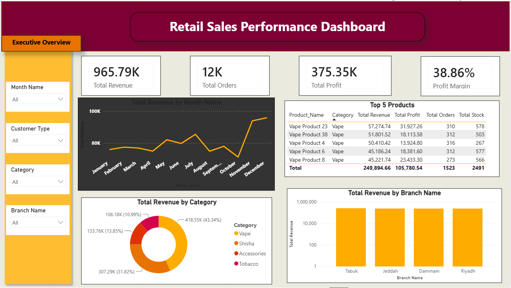
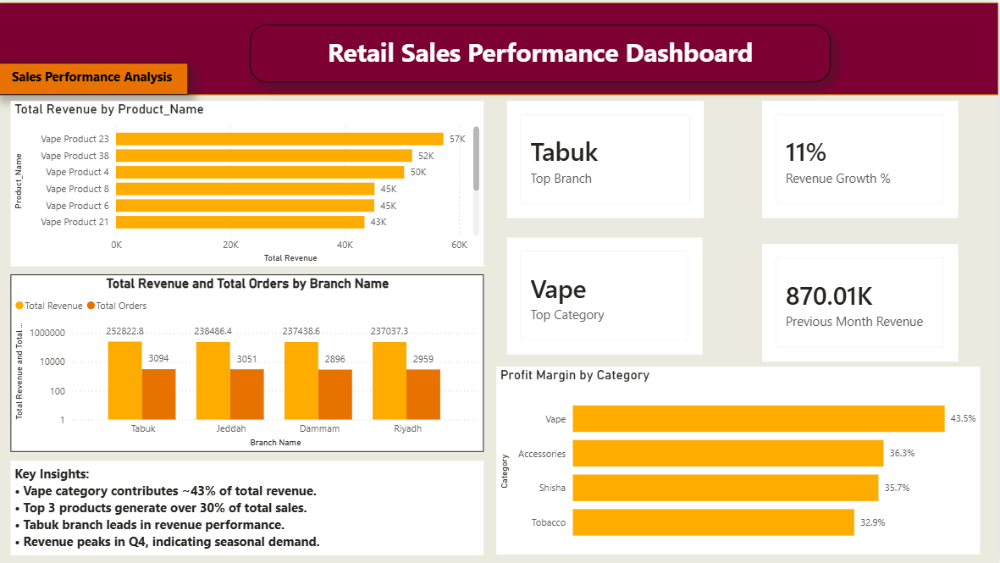
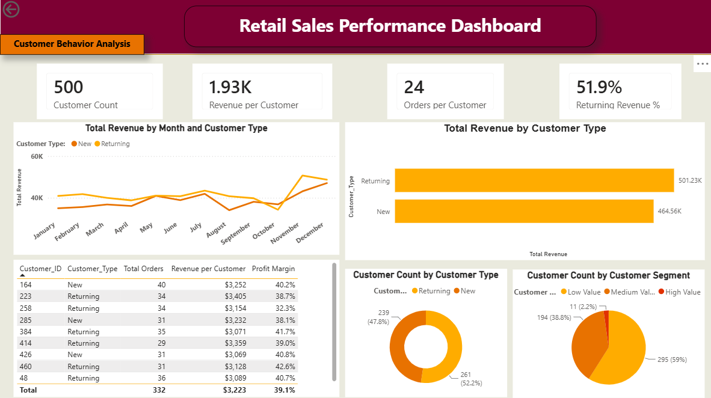
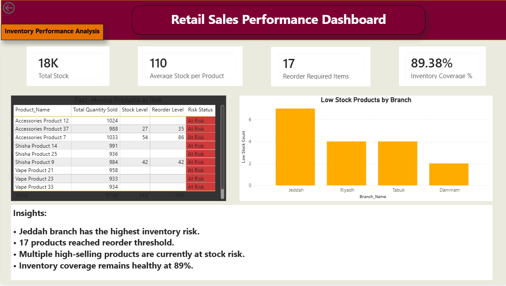
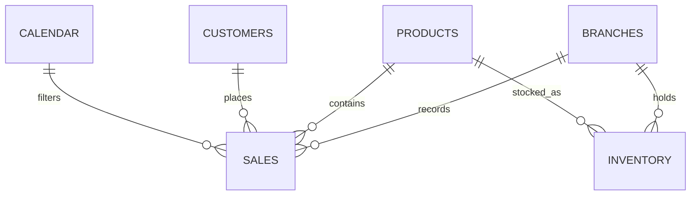

# Saudi Retail Business Intelligence Dashboard

An end-to-end Power BI solution for monitoring retail revenue, profitability, customer behavior, inventory health, and branch performance in Saudi Arabia.



## Executive Snapshot

| KPI | Result |
|---|---:|
| Total revenue | **965.79K** |
| Total profit | **375.35K** |
| Profit margin | **38.86%** |
| Total orders | **12K** |
| Customers | **500** |
| Returning-customer revenue | **51.9%** |
| Inventory coverage | **89.38%** |
| Reorder-required products | **17** |

## Business Problem

The business needed one reliable reporting layer for questions that were previously difficult to answer across separate sales, customer, inventory, product, and branch records:

- Which products, categories, and branches drive revenue and profit?
- How much revenue comes from returning customers?
- Which customer segments deserve retention attention?
- Which fast-moving products are approaching a stockout?
- Where should management prioritize replenishment and inventory review?

## Solution

I built a four-page Power BI report that combines executive KPIs with drill-down analysis:

1. **Executive Overview** — revenue, orders, profit, margin, monthly trend, category mix, branches, and top products.
2. **Sales Performance** — product contribution, branch comparison, category margins, growth, and previous-month revenue.
3. **Customer Behavior** — customer value, new vs. returning behavior, revenue contribution, and segmentation.
4. **Inventory & Operations** — stock coverage, reorder signals, fast-moving risk, and low-stock exposure by branch.

## Key Findings

### Sales and profitability

- Revenue reached **965.79K**, generating **375.35K** in profit at a **38.86% margin**.
- Revenue grew **11%** from **870.01K** in the previous month.
- The **Vape** category produced **418.55K**, or **43.34% of total revenue**, and had the strongest category margin at **43.5%**.
- **Tabuk** was the top branch at approximately **252.82K**, representing about **26.2% of total revenue**.
- The top five products generated **249.89K**, approximately **25.9% of total revenue**.
- Monthly revenue accelerated in November and December, making Q4 the strongest period in the report.

### Customer behavior

- The dashboard tracks **500 customers** and approximately **1.93K revenue per customer**.
- Returning customers contributed **501.23K**, or **51.9% of revenue**, compared with **464.56K** from new customers.
- Customer count remained balanced: **261 new customers (52.2%)** and **239 returning customers (47.8%)**.
- The value segmentation contains **295 low-value (59.0%)**, **194 medium-value (38.8%)**, and **11 high-value customers (2.2%)**.

### Inventory and operations

- Total stock was approximately **18K**, with an average of **110 units per product**.
- **17 products** reached the reorder threshold while overall inventory coverage remained **89.38%**.
- **Jeddah** had the highest low-stock exposure with **7 products**, followed by Riyadh and Tabuk with 4 each, and Dammam with 2.
- Several high-selling products were simultaneously flagged as at risk, creating a direct threat to future revenue if replenishment is delayed.

## Business Recommendations

1. Review the 17 reorder-required products weekly and prioritize fast-moving items with the highest revenue contribution.
2. Investigate Jeddah's inventory allocation and replenishment lead time because it carries the largest low-stock exposure.
3. Protect availability in the Vape category, which contributes 43.34% of revenue and the strongest category margin.
4. Build retention campaigns for medium- and high-value customers while tracking returning-customer revenue as a loyalty KPI.
5. Use branch-level demand and stock risk together when reallocating inventory.
6. Prepare Q4 inventory earlier to capture the stronger demand observed in November and December.

## Dashboard Pages

### 1. Executive Overview


### 2. Sales Performance



### 3. Customer Behavior



### 4. Inventory & Operations



## Data Model

The report uses a structured model centered on sales activity, supported by customer, product, branch, calendar, and inventory tables. See the documented [data model and relationship map](docs/data-model.md).



## Measures

The dashboard uses dedicated measures for revenue, orders, profit, customer behavior, growth, and inventory risk. The [KPI and measure reference](docs/kpi-reference.md) documents the measures verified in the PBIX report and their business purpose.

## Tools & Skills Demonstrated

- Power BI
- DAX measures and time-intelligence KPIs
- Power Query
- Data modeling
- Executive KPI design
- Customer segmentation
- Sales and profitability analysis
- Inventory risk monitoring
- Data storytelling and business recommendations

## Repository Structure

```text
retail-business-intelligence-dashboard/
├── README.md
├── Saudi_Retail_BI_Dashboard.pbix
├── Saudi_Retail_BI_Dashboard_Report.pdf
├── docs/
│   ├── data-model.md
│   └── kpi-reference.md
└── images/
    ├── executive-overview.png
    ├── sales-performance.png
    ├── customer-behavior.png
    └── inventory-operations.png
```

## How to Review the Project

1. Read the executive snapshot and key findings above.
2. Review the four dashboard screenshots.
3. Open the PDF for the complete management-facing report.
4. Open `Saudi_Retail_BI_Dashboard.pbix` in Power BI Desktop for interactive filtering and model inspection.

## Data Quality & Confidentiality

Client and store identifiers are anonymized. Product names are generic where necessary, and sensitive operational details are excluded. The PBIX is provided for portfolio review; the underlying model and dashboard logic remain available for inspection in Power BI Desktop.

## Important Validation Note

All figures in this README were transcribed or calculated from the dashboard outputs included in this repository. Percentages derived from displayed totals are rounded to one decimal place.

## Author

**Yasir Awad**  
Data Analyst | Business Intelligence | Energy & Operations Analytics

- [GitHub](https://github.com/Yasir101-hi)
- [LinkedIn](https://www.linkedin.com/in/yasirawad)
- Email: `yasir.petro.analytics@outlook.com`
