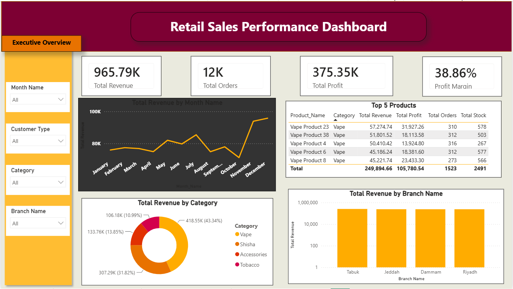
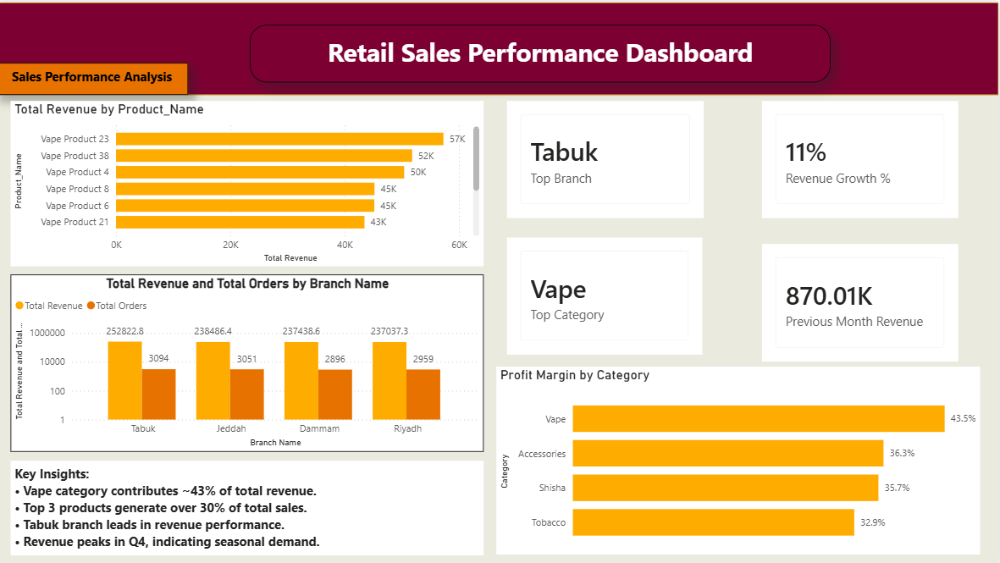
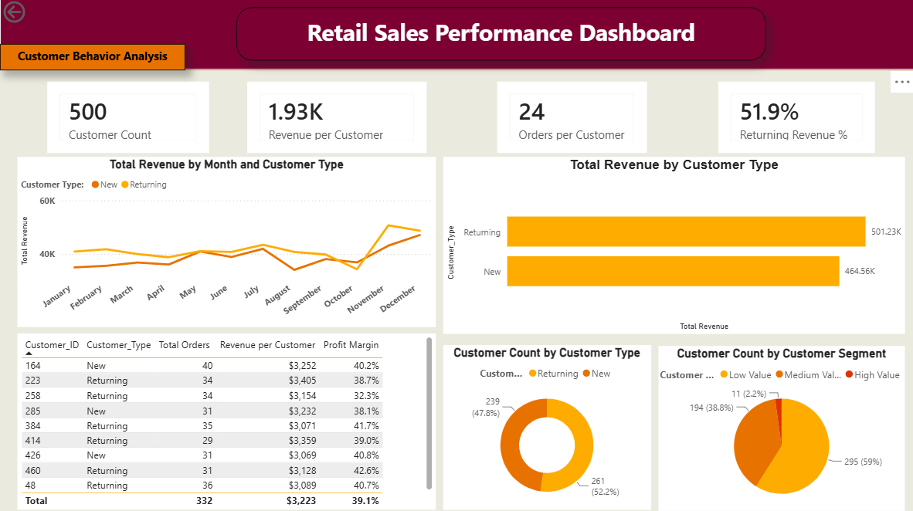

# Retail Business Intelligence Dashboard – Saudi Arabia

## Project Overview

This project is a Business Intelligence case study developed using **Power BI** for a retail business operating in Saudi Arabia.

The goal of the project was to transform raw retail sales and operational data into an interactive dashboard that helps management monitor sales performance, understand customer behavior, identify inventory risks, and improve branch-level decision-making.

This dashboard was designed as part of a freelance retail analytics project to provide business owners and managers with clear, actionable insights through executive-level reporting.

---

## Business Context

Retail businesses often generate large amounts of daily operational data from sales transactions, branches, products, customers, and inventory movements. However, without a centralized reporting system, it becomes difficult for management to answer key business questions quickly.

The business needed a dashboard that could help answer questions such as:

* Which branches generate the highest revenue?
* What are the overall sales trends over time?
* Which products are fast-moving and need better stock monitoring?
* Are there products at risk of stock shortage?
* Which customers contribute the most to revenue?
* How can customer purchasing behavior be segmented?
* What KPIs should management monitor regularly?
* Where are the main operational and inventory risks?

---

## Business Problem

The retail business lacked centralized visibility into sales, customer, inventory, and branch performance. Management faced challenges in tracking KPIs, identifying high-value customers, monitoring low-stock products, and understanding operational performance across branches.

Main challenges included:

* Limited visibility into sales performance across branches
* Difficulty identifying customer purchasing behavior and retention trends
* Lack of inventory risk monitoring and reorder visibility
* No centralized KPI reporting for executive decision-making
* Operational delays caused by low-stock products and fast-moving item shortages

---

## Project Objectives

The main objective was to build an end-to-end Power BI dashboard that provides clear business insights and supports data-driven decision-making.

Key objectives:

* Build an executive overview dashboard for high-level KPI monitoring
* Analyze sales performance across branches and time periods
* Identify customer segments based on purchasing behavior
* Monitor inventory health and operational risks
* Highlight fast-moving products and low-stock items
* Support business owners with actionable recommendations

---

## Dashboard Pages

The Power BI report includes the following dashboard pages:

| Dashboard Page                  | Purpose                                          |
| ------------------------------- | ------------------------------------------------ |
| Executive Overview              | High-level KPI reporting and summary metrics     |
| Sales Performance Analysis      | Revenue trends and branch performance analysis   |
| Customer Behavior Analysis      | Customer segmentation and retention insights     |
| Inventory & Operations Analysis | Inventory health and operational risk monitoring |

---

## Key Business Questions

### Sales Performance

* What is the total revenue generated?
* How does revenue change over time?
* Which branches perform best and worst?
* Which products contribute most to sales?
* Are there seasonal or monthly sales patterns?

### Customer Behavior

* Who are the most valuable customers?
* How can customers be segmented based on purchasing behavior?
* What percentage of revenue comes from returning customers?
* Which customer groups should be targeted for retention?

### Inventory & Operations

* Which products are moving fastest?
* Which products are at risk of stock shortage?
* Which branches experience inventory pressure?
* What items require better replenishment planning?
* How can inventory risks be monitored proactively?

### Management KPIs

* What KPIs should management track daily or weekly?
* Which areas need operational attention?
* How can sales, inventory, and customer insights be combined into one decision-making dashboard?

---

## Tools & Technologies

* Power BI
* DAX
* Power Query
* Data Modeling
* Excel / CSV datasets
* Business Intelligence Reporting
* Data Visualization
* KPI Design

---

## Key Insights

The dashboard helped identify several important business insights:

* Returning customers contributed significantly to total revenue.
* Fast-moving products showed higher inventory risk exposure.
* Branch-level analysis highlighted operational inventory pressure.
* Customer segmentation helped classify low, medium, and high-value customers.
* KPI-driven reporting improved operational visibility and supported better decision-making.

---

## Business Recommendations

Based on the dashboard analysis, the following recommendations were proposed:

* Improve inventory replenishment strategies for high-demand products.
* Monitor fast-moving products more frequently to reduce stock shortage risks.
* Develop customer retention initiatives for medium and high-value customers.
* Track branch-level inventory pressure to improve operational planning.
* Expand executive KPI monitoring to support regular business performance reviews.
* Use customer segmentation insights to design targeted sales and marketing campaigns.

---

## Project Outcome

This project demonstrated how Power BI can be used to transform raw retail data into a practical decision-support tool.

The dashboard provided management with a centralized view of sales performance, customer behavior, inventory risks, and branch operations. It also strengthened practical skills in business intelligence, KPI design, data storytelling, customer analytics, and operational reporting.

---

## Files Included

* `Sales Project.pbix` – Power BI dashboard file
* `Saudi_Retail_BI_Dashboard_Report.pdf` – Business intelligence report documenting the project overview, business problem, dashboard structure, key insights, and recommendations
* `README.md` – Project documentation

---

## Dashboard Preview

Add dashboard screenshots here after exporting them from Power BI.

Suggested screenshots:

1. Executive Overview
2. Sales Performance Analysis
3. Customer Behavior Analysis
4. Inventory & Operations Analysis

Example:

```markdown




```

---

## Confidentiality Note

This project was created for a retail business use case in Saudi Arabia. Any sensitive business or client information has been anonymized or excluded to protect confidentiality.

---

## Author

**Yasir Awad**
Data Analyst | Business Intelligence | Energy & Operations Analytics

* LinkedIn: https://www.linkedin.com/in/yasirawad
* GitHub: https://github.com/Yasir101-hi
* Email: [yasir.petro.analytics@outlook.com](mailto:yasir.petro.analytics@outlook.com)

---

## Project Status

Completed. Additional dashboard screenshots and project updates may be added later.
