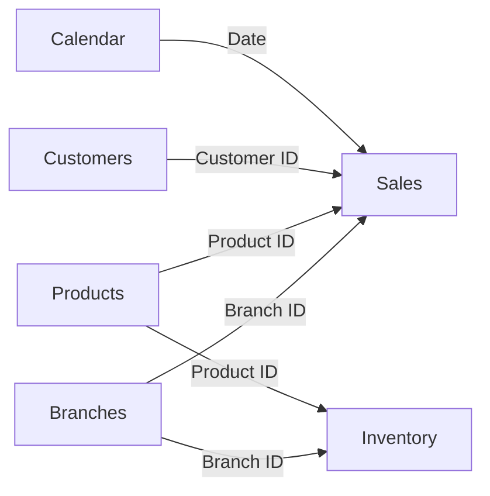

# Data Model

## Overview

The PBIX model contains the following business tables identified from the report metadata:

| Table | Role | Examples of fields used by report visuals |
|---|---|---|
| `sales` | Transaction-level sales activity | Order date, customer, product, branch, quantity, revenue and profit inputs |
| `calendar` | Date dimension | Month name and chronological reporting |
| `customers` | Customer dimension | Customer ID, customer type and customer segment |
| `products` | Product dimension | Product name and category |
| `branches` | Branch dimension | Branch name |
| `inventory` | Inventory fact-like table | Stock level, reorder level and risk status |

The PBIX also contains dedicated measure tables used to organize calculations by dashboard page. In the report metadata these appear as `P1`, `Pg2`, `P3`, and `pg4`.

## Logical Relationship Map

## Modeling Approach

- `sales` provides the primary transactional grain for revenue, order, profit, product, customer, branch, and time analysis.
- Dimension tables provide consistent labels and filters across report pages.
- `inventory` supports stock and reorder analysis by product and branch.
- Dedicated measure tables keep calculations separate from raw fields and make the model easier to navigate.

## Validation

The table names and report fields above were verified from the PBIX report and diagram metadata. Review the Model view in Power BI Desktop for the authoritative relationship cardinality, active/inactive state, and cross-filter direction.

